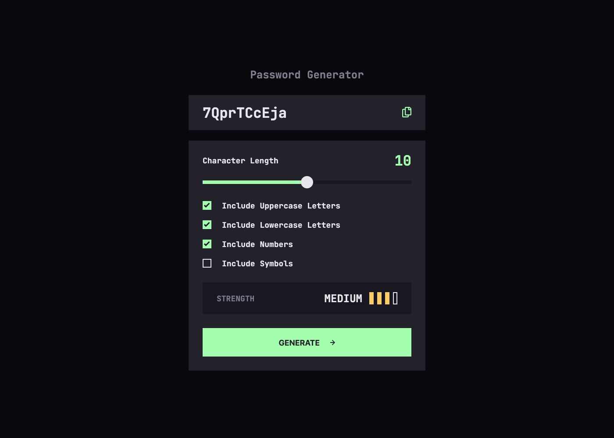

# Password generator app solution

This is a solution to the [Password generator app challenge on Frontend Mentor](https://www.frontendmentor.io/challenges/password-generator-app-Mr8CLycqjh). Frontend Mentor challenges help you improve your coding skills by building realistic projects.

## About the Project

This project is a customizable password creation tool built with `React`, `Vite`, and `Scss`, allowing users to generate secure passwords with varied criteria and strength feedback.

## Preview and Links

<b>Open Preview</b>

 

 

| [Live Demo URL](https://ionstici.github.io/password-generator-app) | [Frontend Mentor](https://www.frontendmentor.io/solutions/password-generator-app--yHzScHIP1) |
| ------------------------------------------------------------------ | -------------------------------------------------------------------------------------------- |

## Features

- **Customizable Password:** Options to include uppercase, lowercase, numbers, and symbols.
- **Password Length:** Users can select a length from 1 to 20 characters.
- **Password Strength Indicator:** A bar showing the strength of the password: _Too Weak!, Weak, Medium, Strong_.
- **Generate Button:** Instantly generates a new password based on the selected criteria.
- **Copy to Clipboard:** A button to copy the generated password for easy use.
- **Responsive Design:** Ensures usability across different devices.

## Tech Stack

- `React`: For creating interactive UI components.
- `Vite`: Provides a rapid and modern development environment.
- `Scss`: For styling, allowing for a clean look.

## Deployment

This project is hosted on **GitHub Pages**.
